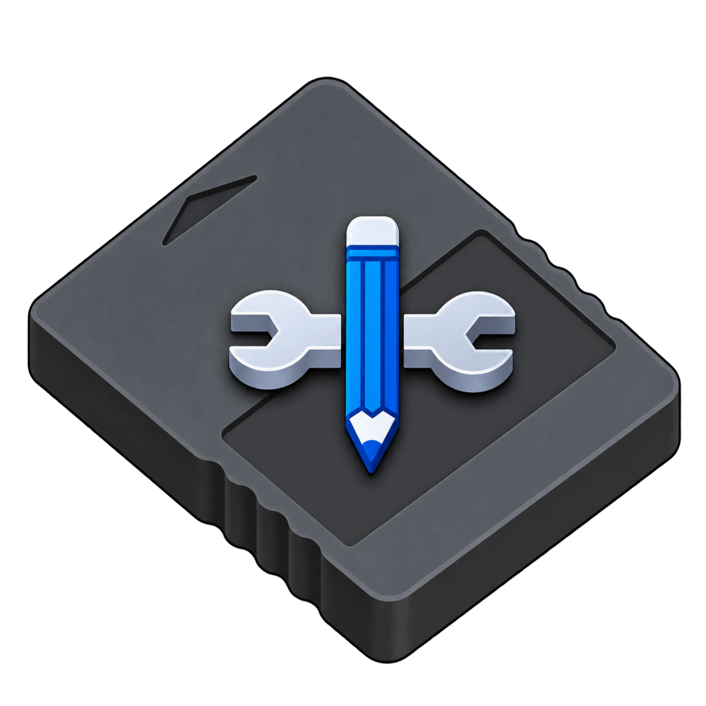

  

<h1 align="center">PS2 Memory Card Reader & Editor for Android</h1>

  <strong>A modern, standalone PlayStation 2 Memory Card Reader, Manager, and Savegame Editor for Android.</strong>

  
  
  
  
  
  

---

## Overview

**PS2 Memory Card Reader & Editor** is a feature-rich, standalone utility engineered for Android devices to browse, manage, inspect, backup, and edit PlayStation 2 memory cards and savegames. Designed natively using **Jetpack Compose** and **Material You (Material 3)**, it offers a seamless mobile experience for emulator enthusiasts (PCSX2, ARMSX2, AetherSX2, NetherSX2) and real PS2 console owners managing saves over USB-OTG adapters or SD cards.

---

## Key Features

### 🗂️ Memory Card Management & Creation
- **NAND Flash Erased State (Unformatted Cards)**: Create pristine unformatted memory cards initialized to `0xFF` (erased flash state), byte-for-byte identical to cards created by PCSX2 / ARMSX2 (`FileMcd_CreateNewCard`). Eliminates write-corruption and recovery loops inside the PS2 BIOS browser and game engines.
- **Pre-formatted Cards**: Generate ready-to-use memory cards with a valid Superblock, indirect FAT allocation tables, and root directory entries.
- **Multiple Capacities**: Support for standard 8MB cards as well as extended 16MB, 32MB, 64MB, and 128MB cards with accurate cluster geometry.
- **In-App Formatting**: Format unformatted or damaged memory cards directly inside the app with a single tap.
- **ECC & RAW Conversion**: Convert on the fly between **ECC format** (528 bytes/page with 16-byte Reed-Solomon/Hamming parity spare area) and **RAW format** (512 bytes/page).
- **Folder Memory Cards**: Open and browse PCSX2 folder-type memory cards (`_pcsx2_superblock` and hierarchical directory trees).

### 🎮 Savegame Management & Tools
- **Multi-Format Archive Support**:
  - **PSU / EMS**: Import and export standard `.psu` saves compatible with EMS and PS2SaveBuilder.
  - **Action Replay MAX**: Unpack and import compressed `.max` savegame containers.
  - **CodeBreaker**: Unpack and import `.cbs` savegame archives.
  - **ZIP Archives**: Export save folders as `.zip` packages for easy backup and sharing.
- **Save File Inspection**: View full directory listings, individual file sizes, creation/modification timestamps, and copy protection flags.
- **Save Deletion & Slot Defragmentation**: Safely remove save directories with full cluster chain deallocation and parent directory slot re-indexing.

### 🎨 Visuals & Diagnostics
- **3D Save Icon Rendering**: Decodes PS2 `.icn` / `.ico` 16-bit RGB1555 texture data directly into full-color Android Bitmaps for save card thumbnails.
- **Shift-JIS & Full-Width Text Decoding**: Accurately decodes CP932 / Shift-JIS Japanese and Western game titles and subtitles stored in `icon.sys`.
- **`icon.sys` Inspector**: View 3D icon filenames, lighting direction vectors, ambient colors, and copy-protection attributes.
- **Diagnostics & Hex Viewer**:
  - Detailed card diagnostic modal showing superblock version, cluster allocation statistics, and bad block status.
  - Built-in hex viewer to inspect any raw file or sector.

### 📱 Modern Android UI
- **Material You (Material 3)**: Dynamic color theming on Android 12+ (SDK 31+) with retro PlayStation deep blue & cyan accents on Android 8–11.
- **Autobreak Layout**: Responsive `FlowRow` layouts for capacity pills and creation modes prevent horizontal overflow and clip gracefully across any screen size.
- **Scrollable Dialogs**: Designed for all screen sizes, foldables, and landscape orientations.
- **Storage Access Framework (SAF)**: Full Android SAF integration to load, edit, and export cards across internal storage, SD cards, and USB OTG drives.

---

## Supported File Formats

| Format | Extension | Description |
| :--- | :--- | :--- |
| **ECC Memory Card** | `.ps2` | Standard 528 B/page format with ECC parity used by PCSX2 and ARMSX2 |
| **RAW Memory Card** | `.raw`, `.bin`, `.mc2`, `.mcd`, `.vmc` | Raw 512 B/page memory card images without spare area |
| **Folder Memory Card** | Directory | PCSX2 folder-style memory cards containing `_pcsx2_superblock` |
| **PSU Save Archive** | `.psu` | Standard EMS / PS2SaveBuilder container format |
| **Action Replay MAX** | `.max` | Compressed Datel Action Replay MAX save archive |
| **CodeBreaker** | `.cbs` | Pelican CodeBreaker save archive |
| **ZIP Archive** | `.zip` | Compressed archive containing save folder contents |

---

## Building with GitHub Actions

The repository includes a ready-to-run GitHub Actions workflow:

1. Navigate to the **Actions** tab in the repository.
2. Select **Build PS2 Memory Card Editor APK**.
3. Click **Run workflow**, pick your branch and build type (`release` or `debug`), and click **Run workflow**.
4. When finished, download the compiled APK artifact directly from the workflow summary page.

---

## Credits & Acknowledgements

Special appreciation and credit are extended to the open-source projects, emulators, and researchers whose work made this tool possible:

- **[PCSX2/myMCpp](https://github.com/PCSX2/myMCpp)**: Sincere thanks to the **PCSX2** contributors and developers of **myMCpp** for their modern C++ PS2 memory card implementation, accurate directory specifications, cluster allocation rules, and PSU handling logic, which served as our primary core reference.
- **[ARMSX2/ARMSX2](https://github.com/ARMSX2/ARMSX2)**: Huge thanks to the **ARMSX2** project and development team for pioneering PlayStation 2 emulation on Android devices, inspiring mobile-first memory card management, and establishing standard unformatted memory card initialization routines.
- **[PCSX2 Team](https://github.com/PCSX2/pcsx2)**: For the legendary PCSX2 emulator, SIO/memory card subsystem implementations, and folder memory card specifications.
- **Ross Ridge**: For the groundbreaking reverse-engineering research and documentation on the PlayStation 2 Memory Card File System and the original `mymc` utility.

---

## License

This project is licensed under the **GNU General Public License v3.0 or later** ([GPL-3.0-or-later](COPYING.GPLv3)).

## Donation 

| Platform | Link |
| :--- | :--- |
| **Ko-fi** | [ko-fi.com/mininxd](https://ko-fi.com/mininxd) |
| **Saweria** | [saweria.co/mininxd](https://saweria.co/mininxd) |
